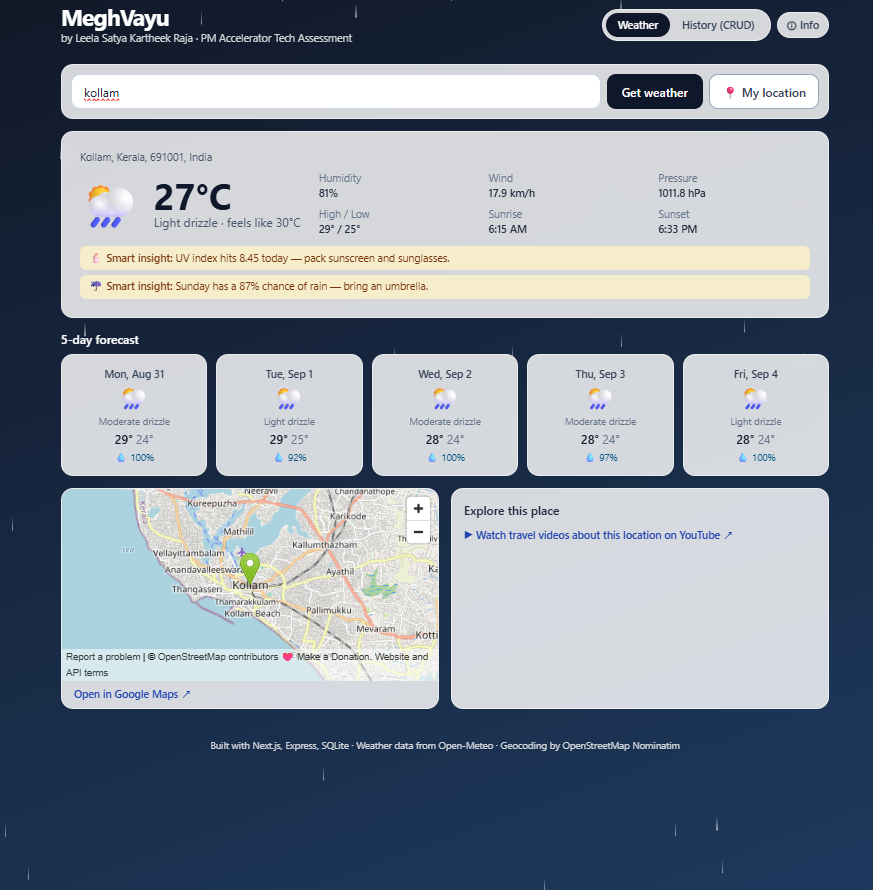
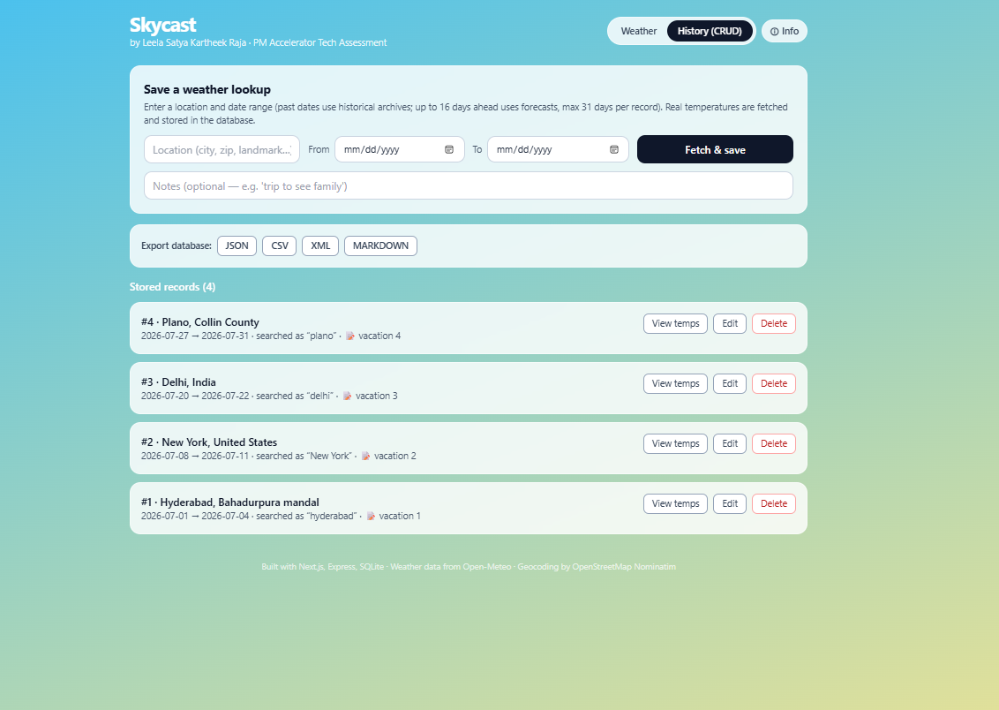
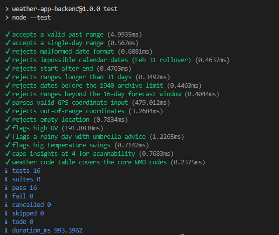

# MeghVayu : Full-Stack Weather App

**PM Accelerator : AI Engineer Intern Technical Assessment (Full Stack: Assessment #1 + #2)**

Built by: **Leela Satya Kartheek Raja**

A full-stack weather application: real-time conditions and a 5-day forecast on the frontend, plus a REST API with database persistence (CRUD), validation, multi-format export, and additional API integrations on the backend. *MeghVayu* means "cloud and wind" in Telugu.

**Stack:** Next.js (JavaScript) frontend + **Python (FastAPI)** backend with SQLite, as required for the Full Stack track. An equivalent Node/Express implementation of the same API is included in `backend-node/` for reference.

## 🔗 Live demo

- **App:** [meghvayu](https://meghvayu.vercel.app/)
- **API health check:** [API Health Check](https://meghvayu-weatherapp.onrender.com/api/health)
- **Demo video:** ADD_YOUR_VIDEO_LINK
- The live deployment has both optional integrations enabled: OpenWeatherMap fallback and YouTube video listings.

> Note: the backend runs on Render's free tier and sleeps when idle, so the first request may take about 30 seconds to wake up. Free-tier storage resets on redeploy, so saved records are not permanent on the live demo.

## Highlights

- Both assessments (frontend + backend) in one integrated app
- **17 unit tests** on validation, insights and provider logic : `cd backend && pytest`
- **Smart insights**: rule-based analysis of the forecast produces traveler advice (pack layers, umbrella day, best outdoor day)
- **Production resilience**: retry with backoff, 10-minute response cache, and an automatic fallback weather provider (added after a real rate-limit incident, see Debugging notes)
- Condition-driven UI: background theme + ambient particles (rain/snow/stars/lightning) follow live weather; honors `prefers-reduced-motion`
- Zero API keys required to run locally

---

## Smart Insights engine

The backend includes a rule-based insights engine (`backend/services/insights.js`) that analyzes
live forecast data and generates actionable traveler advice, the "what's not obvious" thinking
the assessment asks for:

- **High UV** → sunscreen reminder
- **Temperature swings ≥8°C across the week** → pack layers
- **First day with ≥60% rain probability** → umbrella advice, day named
- **Winds ≥35 km/h** → wind warning
- **Extreme heat (≥35°C) / sub-freezing days** → safety notes
- **Best outdoor day** → scores each day on rain, wind, and distance from ideal temperature

Insights are computed server-side per request, capped at 4 for scannability, and unit-tested.

**Design note:** this is deliberately deterministic rules rather than an LLM call : zero latency,
zero cost, fully testable. The architecture supports swapping in an LLM for natural-language
weather summaries as a next step.

## Screenshots

##### Live weather with condition-driven theme and smart insights


##### Weather history : CRUD with database persistence and exports


##### 17 passing unit tests


----

## Tech stack

| Layer | Technology | Why |
|---|---|---|
| Frontend | **Next.js 14 (React)** + Tailwind CSS | JS framework per assessment rules; responsive, web-first |
| Backend | **Python 3.11+ + FastAPI** (uvicorn) | RESTful API with automatic OpenAPI docs at `/docs`; Python per the Full Stack track requirement |
| Database | **SQLite** (Python standard library `sqlite3`) | Zero-config persistence, reviewers can run it with no DB setup |
| Alt. backend | Node.js + Express (`backend-node/`) | Same API contract; included as a reference implementation |
| Weather data (primary) | **Open-Meteo** (forecast + historical archive APIs) | Free, no API key, supports past date ranges |
| Weather data (fallback) | **OpenWeatherMap** (optional key) | Per-key limits, keeps the live site working when the primary provider is rate-limited |
| Geocoding | **OpenStreetMap Nominatim** | Free fuzzy matching for cities, zips, landmarks, coordinates |
| Extra APIs | OpenStreetMap embed, Google Maps link, **YouTube Data API v3** (optional key) | Assessment section 2.2 : map data + real video listings for the searched location |

No API keys are required to run the app locally. Two optional keys unlock extras:

| Variable | Purpose |
|---|---|
| `OPENWEATHER_API_KEY` | Enables the automatic fallback weather provider (recommended for hosted deployments) |
| `YOUTUBE_API_KEY` | Lists YouTube videos for a location; without it the app shows a search link instead |

## How to run

Prerequisites: Python 3.11+ and Node.js 18+.

**1. Backend** (Python/FastAPI, port 4000):
```bash
cd backend
python -m venv venv
venv\Scripts\activate        # Windows   (macOS/Linux: source venv/bin/activate)
pip install -r requirements.txt
uvicorn main:app --reload --port 4000
```
Interactive API docs: http://localhost:4000/docs

**2. Frontend** (port 3000), in a second terminal:
```bash
cd frontend
npm install
npm run dev
```

Open http://localhost:3000

Optional: copy `frontend/.env.local.example` to `.env.local` to change the backend URL. Set `OPENWEATHER_API_KEY` and/or `YOUTUBE_API_KEY` in the backend environment to enable the optional integrations.

---

## Assessment 1 [Frontend features]

- **Flexible location input**: one search box accepts city, town, zip/postal code, landmarks ("Eiffel Tower"), or raw GPS coordinates ("40.71,-74.00"). Input is geocoded with fuzzy matching, and the resolved place name is always shown so the user can confirm.
- **Current location**: "📍 My location" uses the browser Geolocation API (with permission-denied and timeout handling).
- **Current weather display**: temperature, feels-like, condition + icon, humidity, wind, pressure, high/low, sunrise/sunset.
- **5-day forecast** (§1.1): responsive card grid with icons, conditions, highs/lows, and precipitation chance.
- **Error handling** (§1.2): location not found, backend unreachable, upstream API failure, geolocation denied, empty input. Each shows a clear, actionable message.
- **Responsive design**: Tailwind mobile-first breakpoints (`sm/md/lg`), fluid grids (2→3→5 forecast columns), flexible search bar layout. Works on phone, tablet, and desktop.
- **Traveler-minded extras**: smart insights, sunrise/sunset for planning, and a signature touch: the page background theme and ambient effects shift with live conditions (clear/cloudy/rain/snow/storm, day vs night).

## Assessment 2 [Backend features]

REST API (all JSON, central error handler, auto-generated OpenAPI docs at `/docs`):

| Method | Endpoint | Purpose |
|---|---|---|
| GET | `/api/health` | Health check |
| GET | `/api/weather?location=…` or `?lat=…&lon=…` | Current weather + 5-day forecast + insights |
| POST | `/api/records` | **CREATE** : location + date range → fetches real temps → stores |
| GET | `/api/records` | **READ** all stored records |
| GET | `/api/records/:id` | **READ** one record |
| PUT | `/api/records/:id` | **UPDATE** : re-validates; re-fetches temps if location/range changed |
| DELETE | `/api/records/:id` | **DELETE** a record |
| GET | `/api/export?format=json\|csv\|xml\|markdown` | **Export** (§2.3) all records as file download |
| GET | `/api/extras?location=…` | **§2.2** : map embed + Google Maps link + YouTube videos |

**API integration** (§2.2): `/api/extras` returns an embedded map centered on the geocoded coordinates, a Google Maps deep link, and YouTube travel videos for the location. Videos are fetched from the YouTube Data API v3 when `YOUTUBE_API_KEY` is set (as on the live demo) and fall back to a search link otherwise.

**Validation** (§2.1):
- Date ranges: format, real calendar dates (rejects 2024-02-31), start ≤ end, ≤31 days, within Open-Meteo's data window (1940 → +16 days).
- Locations: must resolve via geocoder (fuzzy match allowed); clear 404 with suggestions if not found.
- Updates: same validation; `temperature_data` is always re-derived from the APIs when location/dates change, so stored weather can never contradict the stored location. Users edit location/dates/notes, not raw temperatures.

**Design decisions**:
- Historical ranges use Open-Meteo's archive API; near-future ranges use the forecast API. The correct source is chosen automatically.
- SQLite chosen deliberately: reviewers clone and run with zero database setup. Swappable for Postgres via the single `db.py` module.
- FastAPI chosen for the backend: type-hinted request handling, automatic OpenAPI documentation, and it is the natural home for future AI/ML features (the role is AI Engineer).
- Weather requests go through a retry-with-backoff layer and a 10-minute in-memory cache; if the primary provider fails, the backend transparently switches to OpenWeatherMap and normalizes its data into the same response shape, so the frontend never changes.

## Project structure

```
backend/                   Python / FastAPI (primary)
  main.py                  App, CORS, central error handling
  db.py                    SQLite schema + connection
  errors.py                ApiError -> clean JSON error responses
  services/geocode.py      Nominatim geocoding (fuzzy, zips, landmarks, GPS)
  services/weather.py      Open-Meteo calls, retry/cache layer, date-range validation
  services/openweather.py  OpenWeatherMap fallback provider (normalized to Open-Meteo shape)
  services/insights.py     Rule-based smart insights engine
  routes/                  weather, records (CRUD), export, extras
  tests/                   Unit tests (pytest)
  requirements.txt
backend-node/              Node.js / Express reference implementation of the same API
frontend/
  app/                     Next.js app router pages + condition-driven theming
  components/              WeatherPanel, RecordsPanel (CRUD UI), WeatherEffects, shared lib
```

## Debugging notes (real issues found & fixed)

1. **Ambiguous zip codes resolved internationally.** Testing with `76201` (Denton, TX) returned Šiauliai, Lithuania : Nominatim matched the digits to a foreign postal code. Fix: bare 5-digit codes are now biased to `countrycodes=us`, while longer codes (e.g., Indian 6-digit PINs) and "zip, country" queries still resolve worldwide. Verified with mixed US/India test data.
2. **CSV exports showed garbled characters in Excel.** Non-ASCII place names (Cyrillic, Lithuanian) rendered as mojibake because Excel doesn't assume UTF-8. Fix: prepend a UTF-8 BOM to CSV output.
3. **Node 24 native-module build failure** (Node reference backend). `better-sqlite3@11` had no prebuilt binary for Node 24 and attempted a source compile requiring Visual Studio C++ tools. Fix: upgraded to `better-sqlite3@^12`, which ships Node 24 prebuilds. The Python backend avoids native modules entirely by using the standard-library `sqlite3`.
4. **Shared-IP rate limiting in production.** After deploying to Render's free tier, weather requests started failing. The generic error hid the cause, so the first fix was surfacing the upstream status: `HTTP 429, Daily API request limit exceeded`. Render's free tier shares one outbound IP across many apps, and Open-Meteo's 10,000/day per-IP limit had been exhausted by other tenants. Fix: retry with backoff, a 10-minute response cache, and an automatic fallback to OpenWeatherMap (per-key limits, immune to shared IPs), normalized into the same response shape so no frontend changes were needed. Localhost was never affected because it uses its own IP.

## Testing

```bash
cd backend
pytest
```
17 tests cover date-range validation (format, impossible dates like Feb 31, range limits, archive/forecast windows), GPS coordinate parsing, the insights engine, and the fallback provider's condition-code mapping. The Node reference implementation has an equivalent suite (`cd backend-node && npm test`).

## About PM Accelerator

The Product Manager Accelerator Program supports PM professionals through every stage of their career, from students seeking their first PM role to directors and leaders growing their leadership skills via hands-on training, coaching, and a global community. See their [LinkedIn page](https://www.linkedin.com/school/pmaccelerator/).